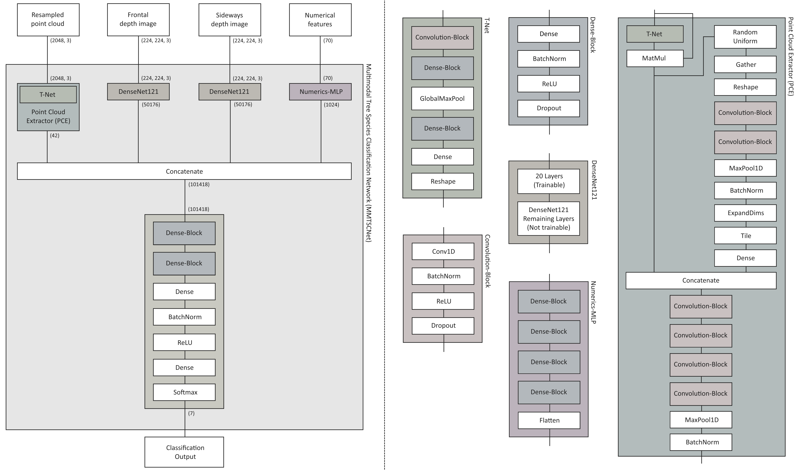

# MMTSCNet-GUI
This is the official repository for MMTSCNet GUI (Multimodal Tree Species Classification Network Graphic User Interface). This network was developed to accurately classify LiDAR point clouds of individual trees by augmenting the existing geometric information from the point cloud with metrics and frontal as well as sideways views of the point clouds. This approach ensures as much information as possible is captured and allows for very high accuracies when classifying coniferous and broadleaf tree species.

# Model architecture


The architecture is composed of four branches, each handling a different type of input data, hence the name "Multimodal". The first branch extracts features from 68 different metrics, generated from geometric properties of the point clouds themselves as well as full-waveform LiDAR data if available. The second and third branch use an instance of DenseNet121 to extract features from the frontal and sideways views of the tree point clouds and the third branch acts upon the point cloud directly to extract features. The extracted features are then concazenated to create a single feature vector which is fed into fully-connected layers. The resulting feature-rich vector is then classified by a Softmax-Layer.

Using this architecture, the model is able to achieve an Overall Accuracy (OA) of 96.36%, a macro F1-Score of 0.9589 as well as a Precision of 0.9728 and a Recall of 0.9564 over 7 different tree species. The model was trained and used to predict on the PANGAEA dataset of multi-source segmented LiDAR tree point clouds by Weiser et al., available at [https://doi.pangaea.de/10.1594/PANGAEA.942856](https://doi.pangaea.de/10.1594/PANGAEA.942856).

# Installation
To train and use MMTSCNet yourself, follow the installation guide below (NVIDIA GPU required).

#### Step 1: 
Install Visual Studio Code

#### Step 2:
Clone this repository to your local machine.

#### Step 3:
Create a new Conda environment with [Python 3.9.19](https://www.python.org/downloads/release/python-3919/) and activate it.

#### Step 4:
Install CUDA toolkit and CUDNN using the command
```bash
conda install -c conda-forge cudatoolkit=11.2 cudnn=8.1.0
```

#### Step 5:
Install the required python modules using
```bash
pip install -r requirements.txt
```

#### Step 6:
Run the GUI using the command
Install the required python modules using
```bash
python main.py
```

# Data structure
#### Model directory:
Create a new folder anywhere on your local machine and tell the software about it using
```bash
--modeldir "C:\Enter\the\path\to\models\folder\here"
```
All tuned and trained models will be save in this folder, accompanied by metrics plots and confusion matrices.<br>
<br>
<br>

#### Working directory:
Create a new folder anywhere on your local machine and tell the software about it using
```bash
--workdir "C:\Enter\the\path\to\working\folder\here"
```
It is highly recommended to create a working folder with any name, with a subfolder called "source_data" where your source data is located to keep things tidy and clean.<br>
<br>
<br>

#### Data directory:
Create a new folder in your working folder called "source_data" and paste your source data into it. Let the software know by using
```bash
--datadir "C:\Enter\the\path\to\source_data"
```
<br>

Your data itself should follow the structure proposed by the [dataset](https://doi.pangaea.de/10.1594/PANGAEA.942856) to initially train and test the model on, separating properties in filenames with "_".<br>
<br>

**DISCLAIMER:** Full-waveform data is fully optional. It can enhance the models classification accuracy but is not recommended and the software will automatically detect FWF data if it is present.<br>
<br>

```bash
WORKING DIRECTORY
│
└── source_data
    └── las
    │   ├── Plot01.zip
    │   │   ├── ALS
    │   │   │   ├── ALS-on_Plot01_2019-07-05_300m.laz
    │   │   │   ├── ALS-on_Plot01_2019-07-05_trajectory.txt
    │   │   │   └── ...
    │   │   │
    │   │   ├── TLS
    │   │   │   ├── TLS-on_Plot01_2019-07-05.laz
    │   │   │   ├── TLS-on_Plot01_2019-07-05_scan_positions.txt
    │   │   │   └── ...
    │   │   │
    │   │   ├── ULS
    │   │   │   ├── ULS-off_Plot01_2019-07-05.laz
    │   │   │   ├── ULS-off_Plot01_2019-07-05_trajectory.txt
    │   │   │   └── ...
    │   │   │
    │   │   └── single_trees
    │   │       ├── AceCam_Plot01_1
    │   │       │   ├── AceCam_Plot01_1_2019-07-05_quality3_ALS-on.laz
    │   │       │   ├── AceCam_Plot01_1_2019-07-05_quality3_ULS-on.laz
    │   │       │   ├── AceCam_Plot01_1_2019-07-05_quality3_TLS-off.laz
    │   │       │   └── ...
    │   │       │
    │   │       ├── FagSyl_Plot01_2
    │   │       │   └── ...
    │   │       ├── CarBet_Plot01_3
    │   │       │   └── ...
    │   │       └── ...
    │   │
    │   ├── Plot02.zip
    │   │   └── ...
    │   └── ...
    │
    │
    │
    │
    └── fwf
        ├── Plot01.zip
        │   ├── 190705_102252_VQ780i_Linie_0050_BR01_epsg25832.las
        │   ├── 190705_102252_VQ780i_Linie_0050_BR01_epsg25832.wdp
        │   ├── 190705_102252_VQ780i_Linie_0050_BR01_epsg25832_trajectory.txt
        │   ├── 190705_102703_VQ780i_Linie_0051_BR01_epsg25832.las
        │   ├── 190705_102703_VQ780i_Linie_0051_BR01_epsg25832.wdp
        │   ├── 190705_102703_VQ780i_Linie_0051_BR01_epsg25832_trajectory.txt
        │   └── ...
        │
        ├── Plot02.zip
        │   └── ...
        └── ...
```

# No-GUI
A No-GUI version of MMTSCNet is available at [https://github.com/jvahrenhold97/MMTSCNet](https://github.com/jvahrenhold97/MMTSCNet)

# About the creator
MMTSCNet was developed by Jan Richard Vahrenhold during his Masters Thesis at the Technische Hochschule Würzburg-Schweinfurt. You can learn more about Jan [on his website](https://vahrenhol3d.de).
